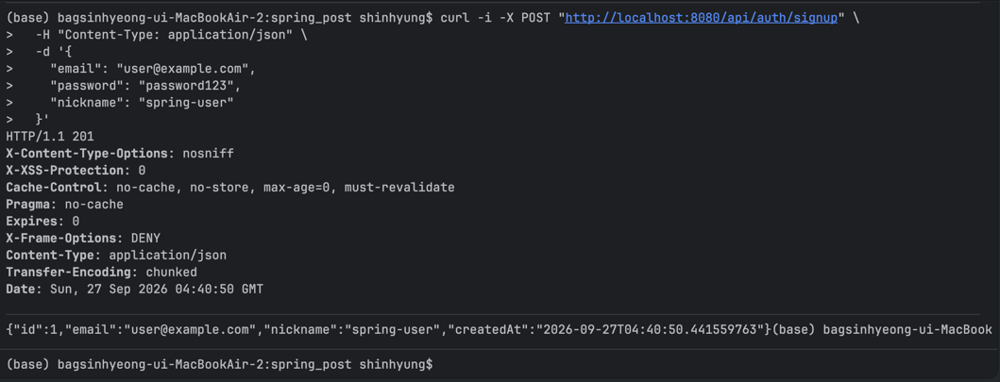
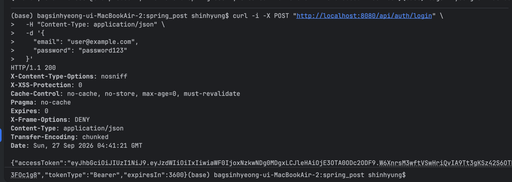

# Spring Security 게시판 REST API

Spring Boot, Spring Security, JWT, PostgreSQL을 사용한 게시판 REST API입니다.

누구나 게시글과 댓글을 조회할 수 있으며, 로그인한 회원만 작성할 수 있습니다. 게시글과 댓글의 수정·삭제는 작성자 본인만 가능합니다.

## 1. 실행 방법

### 필요한 환경

- JDK 21
- Docker Desktop
- Docker Compose

Docker로 실행하는 경우 PostgreSQL을 직접 설치하거나 DB와 계정을 생성할 필요가 없습니다.

### 실행

JWT 서명 키를 생성하면서 PostgreSQL과 Spring Boot 서버를 함께 실행합니다.

```bash
# 서버 실행
JWT_SECRET=$(openssl rand -base64 32) docker compose up --build

# 백그라운드 실행
JWT_SECRET=$(openssl rand -base64 32) docker compose up --build -d

# 실행 상태 확인
docker compose ps

# 서버 종료
docker compose down
```

서버 주소:

```text
http://localhost:8080
```

Docker Compose가 자동으로 준비하는 DB 환경:

| 항목 | 값 |
|---|---|
| DBMS | PostgreSQL 16 |
| Database | `board` |
| Username | `board` |
| Password | `1234` |
| Docker 내부 주소 | `postgres:5432` |

DB 데이터는 Docker Volume에 저장되므로 컨테이너를 다시 실행해도 유지됩니다.

DB 데이터를 포함해 완전히 초기화하려면 다음 명령을 사용합니다.

```bash
docker compose down -v
```

> `docker compose down -v`를 실행하면 저장된 회원, 게시글, 댓글이 모두 삭제됩니다.

---

## 2. API 명세

기본 주소:

```text
http://localhost:8080
```

JWT 인증이 필요한 API는 다음 헤더를 사용합니다.

```http
Authorization: Bearer {accessToken}
```

### 전체 API 요약

| 기능 | 메서드 | 주소 | 인증 | 성공 상태 |
|---|---|---|---|---|
| 회원가입 | `POST` | `/api/auth/signup` | 불필요 | `201 Created` |
| 로그인 | `POST` | `/api/auth/login` | 불필요 | `200 OK` |
| 게시글 작성 | `POST` | `/api/posts` | 필요 | `201 Created` |
| 게시글 목록 | `GET` | `/api/posts` | 불필요 | `200 OK` |
| 게시글 상세 | `GET` | `/api/posts/{postId}` | 불필요 | `200 OK` |
| 게시글 수정 | `PUT` | `/api/posts/{postId}` | 작성자 | `200 OK` |
| 게시글 삭제 | `DELETE` | `/api/posts/{postId}` | 작성자 | `204 No Content` |
| 댓글 작성 | `POST` | `/api/posts/{postId}/comments` | 필요 | `201 Created` |
| 댓글 목록 | `GET` | `/api/posts/{postId}/comments` | 불필요 | `200 OK` |
| 댓글 수정 | `PUT` | `/api/comments/{commentId}` | 작성자 | `200 OK` |
| 댓글 삭제 | `DELETE` | `/api/comments/{commentId}` | 작성자 | `204 No Content` |

### 2.1 회원가입

| 항목 | 내용 |
|---|---|
| 메서드 | `POST` |
| 주소 | `/api/auth/signup` |
| 인증 | 불필요 |
| 요청 본문 | <pre><code>{<br>  "email": "user@example.com",<br>  "password": "password123",<br>  "nickname": "spring-user"<br>}</code></pre> |
| 응답 본문 | <pre><code>{<br>  "id": 1,<br>  "email": "user@example.com",<br>  "nickname": "spring-user",<br>  "createdAt": "2026-09-27T10:00:00"<br>}</code></pre> |
| 성공 상태 | `201 Created` |
| 오류 상태 | `400 Bad Request`, `409 Conflict` |

검증 규칙:

- 이메일은 올바른 형식이어야 하며 중복될 수 없습니다.
- 비밀번호는 8자 이상 72자 이하여야 합니다.
- 닉네임은 공백일 수 없으며 중복될 수 없습니다.
- 비밀번호는 BCrypt로 해시하여 저장하고 응답에는 포함하지 않습니다.

### 2.2 로그인

| 항목 | 내용 |
|---|---|
| 메서드 | `POST` |
| 주소 | `/api/auth/login` |
| 인증 | 불필요 |
| 요청 본문 | <pre><code>{<br>  "email": "user@example.com",<br>  "password": "password123"<br>}</code></pre> |
| 응답 본문 | <pre><code>{<br>  "accessToken": "eyJhbGciOiJIUzI1NiJ9...",<br>  "tokenType": "Bearer",<br>  "expiresIn": 3600<br>}</code></pre> |
| 성공 상태 | `200 OK` |
| 오류 상태 | `400 Bad Request`, `401 Unauthorized` |

### 2.3 게시글 작성

| 항목 | 내용 |
|---|---|
| 메서드 | `POST` |
| 주소 | `/api/posts` |
| 인증 | 필요 |
| 요청 본문 | <pre><code>{<br>  "title": "Spring Security 공부",<br>  "content": "JWT 인증 방식을 학습했습니다."<br>}</code></pre> |
| 응답 본문 | <pre><code>{<br>  "id": 1,<br>  "title": "Spring Security 공부",<br>  "content": "JWT 인증 방식을 학습했습니다.",<br>  "authorId": 1,<br>  "authorNickname": "spring-user",<br>  "createdAt": "2026-09-27T10:10:00",<br>  "updatedAt": "2026-09-27T10:10:00"<br>}</code></pre> |
| 성공 상태 | `201 Created` |
| 오류 상태 | `400 Bad Request`, `401 Unauthorized` |

### 2.4 게시글 목록 조회

| 항목 | 내용 |
|---|---|
| 메서드 | `GET` |
| 주소 | `/api/posts?page=0&size=10` |
| 인증 | 불필요 |
| 쿼리 파라미터 | `page`: 페이지 번호, 기본값 `0`<br>`size`: 페이지 크기, 기본값 `10`, 최대 `100` |
| 요청 본문 | 없음 |
| 응답 본문 | <pre><code>{<br>  "content": [<br>    {<br>      "id": 1,<br>      "title": "Spring Security 공부",<br>      "authorNickname": "spring-user",<br>      "commentCount": 1,<br>      "createdAt": "2026-09-27T10:10:00",<br>      "updatedAt": "2026-09-27T10:10:00"<br>    }<br>  ],<br>  "page": 0,<br>  "size": 10,<br>  "totalElements": 1,<br>  "totalPages": 1,<br>  "first": true,<br>  "last": true<br>}</code></pre> |
| 성공 상태 | `200 OK` |
| 오류 상태 | `400 Bad Request` |

게시글은 작성 시각을 기준으로 최신순으로 반환합니다. 각 게시글에는 작성자 닉네임과 댓글 수가 포함됩니다.

### 2.5 게시글 상세 조회

| 항목 | 내용 |
|---|---|
| 메서드 | `GET` |
| 주소 | `/api/posts/{postId}` |
| 인증 | 불필요 |
| 요청 본문 | 없음 |
| 응답 본문 | <pre><code>{<br>  "id": 1,<br>  "title": "Spring Security 공부",<br>  "content": "JWT 인증 방식을 학습했습니다.",<br>  "authorId": 1,<br>  "authorNickname": "spring-user",<br>  "createdAt": "2026-09-27T10:10:00",<br>  "updatedAt": "2026-09-27T10:10:00"<br>}</code></pre> |
| 성공 상태 | `200 OK` |
| 오류 상태 | `404 Not Found` |

### 2.6 게시글 수정

| 항목 | 내용 |
|---|---|
| 메서드 | `PUT` |
| 주소 | `/api/posts/{postId}` |
| 인증 | 필요, 작성자만 가능 |
| 요청 본문 | <pre><code>{<br>  "title": "수정된 제목",<br>  "content": "수정된 본문입니다."<br>}</code></pre> |
| 응답 본문 | <pre><code>{<br>  "id": 1,<br>  "title": "수정된 제목",<br>  "content": "수정된 본문입니다.",<br>  "authorId": 1,<br>  "authorNickname": "spring-user",<br>  "createdAt": "2026-09-27T10:10:00",<br>  "updatedAt": "2026-09-27T10:20:00"<br>}</code></pre> |
| 성공 상태 | `200 OK` |
| 오류 상태 | `400 Bad Request`, `401 Unauthorized`, `403 Forbidden`, `404 Not Found` |

### 2.7 게시글 삭제

| 항목 | 내용 |
|---|---|
| 메서드 | `DELETE` |
| 주소 | `/api/posts/{postId}` |
| 인증 | 필요, 작성자만 가능 |
| 요청 본문 | 없음 |
| 응답 본문 | 없음 |
| 성공 상태 | `204 No Content` |
| 오류 상태 | `401 Unauthorized`, `403 Forbidden`, `404 Not Found` |

게시글을 삭제하면 해당 게시글의 댓글도 함께 삭제됩니다.

### 2.8 댓글 작성

| 항목 | 내용 |
|---|---|
| 메서드 | `POST` |
| 주소 | `/api/posts/{postId}/comments` |
| 인증 | 필요 |
| 요청 본문 | <pre><code>{<br>  "content": "좋은 글 감사합니다."<br>}</code></pre> |
| 응답 본문 | <pre><code>{<br>  "id": 1,<br>  "content": "좋은 글 감사합니다.",<br>  "authorId": 1,<br>  "authorNickname": "spring-user",<br>  "postId": 1,<br>  "createdAt": "2026-09-27T10:15:00",<br>  "updatedAt": "2026-09-27T10:15:00"<br>}</code></pre> |
| 성공 상태 | `201 Created` |
| 오류 상태 | `400 Bad Request`, `401 Unauthorized`, `404 Not Found` |

### 2.9 댓글 목록 조회

| 항목 | 내용 |
|---|---|
| 메서드 | `GET` |
| 주소 | `/api/posts/{postId}/comments` |
| 인증 | 불필요 |
| 요청 본문 | 없음 |
| 응답 본문 | <pre><code>[<br>  {<br>    "id": 1,<br>    "content": "좋은 글 감사합니다.",<br>    "authorId": 1,<br>    "authorNickname": "spring-user",<br>    "postId": 1,<br>    "createdAt": "2026-09-27T10:15:00",<br>    "updatedAt": "2026-09-27T10:15:00"<br>  }<br>]</code></pre> |
| 성공 상태 | `200 OK` |
| 오류 상태 | `404 Not Found` |

### 2.10 댓글 수정

| 항목 | 내용 |
|---|---|
| 메서드 | `PUT` |
| 주소 | `/api/comments/{commentId}` |
| 인증 | 필요, 작성자만 가능 |
| 요청 본문 | <pre><code>{<br>  "content": "수정된 댓글입니다."<br>}</code></pre> |
| 응답 본문 | <pre><code>{<br>  "id": 1,<br>  "content": "수정된 댓글입니다.",<br>  "authorId": 1,<br>  "authorNickname": "spring-user",<br>  "postId": 1,<br>  "createdAt": "2026-09-27T10:15:00",<br>  "updatedAt": "2026-09-27T10:25:00"<br>}</code></pre> |
| 성공 상태 | `200 OK` |
| 오류 상태 | `400 Bad Request`, `401 Unauthorized`, `403 Forbidden`, `404 Not Found` |

### 2.11 댓글 삭제

| 항목 | 내용 |
|---|---|
| 메서드 | `DELETE` |
| 주소 | `/api/comments/{commentId}` |
| 인증 | 필요, 작성자만 가능 |
| 요청 본문 | 없음 |
| 응답 본문 | 없음 |
| 성공 상태 | `204 No Content` |
| 오류 상태 | `401 Unauthorized`, `403 Forbidden`, `404 Not Found` |

### 오류 응답 형식

모든 오류는 동일한 형태로 응답합니다.

```json
{
  "timestamp": "2026-09-27T10:30:00",
  "status": 400,
  "error": "Bad Request",
  "code": "VALIDATION_ERROR",
  "message": "입력값이 올바르지 않습니다.",
  "path": "/api/auth/signup",
  "fieldErrors": {
    "email": "올바른 이메일 형식이어야 합니다."
  }
}
```

주요 오류 코드:

| 상태 | 오류 코드 | 발생 상황 |
|---:|---|---|
| 400 | `VALIDATION_ERROR` | 입력값 검증 실패 |
| 400 | `INVALID_REQUEST` | JSON 또는 요청 형식 오류 |
| 401 | `UNAUTHORIZED` | JWT가 없거나 올바르지 않음 |
| 401 | `LOGIN_FAILED` | 이메일 또는 비밀번호 불일치 |
| 403 | `FORBIDDEN` | 다른 회원의 글·댓글 수정 또는 삭제 |
| 404 | `MEMBER_NOT_FOUND` | 회원이 존재하지 않음 |
| 404 | `POST_NOT_FOUND` | 게시글이 존재하지 않음 |
| 404 | `COMMENT_NOT_FOUND` | 댓글이 존재하지 않음 |
| 409 | `EMAIL_ALREADY_EXISTS` | 이메일 중복 |
| 409 | `NICKNAME_ALREADY_EXISTS` | 닉네임 중복 |

---

## 3. 설계 설명

### 3.1 JWT 로그인 방식을 선택한 이유

프론트엔드나 모바일 앱에서도 사용할 수 있는 REST API 서버이므로 서버가 로그인 세션을 저장하지 않는 JWT 방식을 선택했습니다.

로그인에 성공하면 서버가 유효 시간 1시간의 Access Token을 발급합니다. 클라이언트는 인증이 필요한 요청마다 다음 헤더로 토큰을 전달합니다.

```http
Authorization: Bearer {accessToken}
```

JWT에는 변경되지 않는 회원 ID만 저장합니다.

```json
{
  "sub": "1",
  "iat": 1790470800,
  "exp": 1790474400
}
```

서버는 요청마다 JWT의 서명과 만료 시간을 검증하고, `sub`에 저장된 회원 ID로 회원을 조회합니다.

과제 범위를 고려해 Refresh Token은 구현하지 않았습니다. JWT 서명 키는 소스 코드나 설정 파일에 저장하지 않고 실행 시 `JWT_SECRET` 환경변수로 전달합니다.

### 3.2 엔티티 관계

```text
Member 1 ── N Post
Member 1 ── N Comment
Post   1 ── N Comment
```

- 한 회원은 여러 게시글을 작성할 수 있습니다.
- 한 회원은 여러 댓글을 작성할 수 있습니다.
- 한 게시글에는 여러 댓글이 작성될 수 있습니다.
- Post와 Comment에서 Member를 작성자로 참조합니다.
- Comment에서 댓글이 속한 Post를 참조합니다.
- 연관관계는 불필요한 즉시 조회를 막기 위해 `LAZY` 로딩을 사용합니다.

### 3.3 게시글 목록 N+1 방지

게시글 목록에는 작성자 닉네임과 댓글 수가 필요합니다.

게시글 목록을 먼저 조회한 뒤 반복문에서 작성자와 댓글을 가져오면 게시글 수만큼 추가 쿼리가 발생할 수 있습니다.

이를 방지하기 위해 게시글, 작성자 닉네임, 댓글 수를 한 번에 가져오는 JPQL 집계 쿼리를 사용했습니다.

```sql
SELECT
    게시글 ID,
    제목,
    작성자 닉네임,
    COUNT(댓글),
    작성 시각,
    수정 시각
FROM 게시글
JOIN 작성자
LEFT JOIN 댓글
GROUP BY 게시글, 작성자
ORDER BY 작성 시각 DESC
```

페이지 목록 조회 시 실행되는 쿼리는 다음과 같습니다.

```text
게시글 목록 집계 쿼리 1번
전체 게시글 수 조회 쿼리 1번
```

게시글마다 작성자와 댓글 수를 별도로 조회하지 않으므로 N+1 문제가 발생하지 않습니다.

댓글 목록에서도 작성자를 함께 가져오는 fetch join을 사용했습니다.

### 3.4 게시글 삭제 시 댓글 처리

게시글이 삭제되면 해당 게시글의 댓글도 함께 삭제하도록 결정했습니다.

Post와 Comment 관계에 다음 설정을 사용했습니다.

```java
@OneToMany(
    mappedBy = "post",
    cascade = CascadeType.ALL,
    orphanRemoval = true
)
```

존재하지 않는 게시글의 댓글이 DB에 남는 것을 방지하고 게시글 삭제 동작을 단순하게 유지할 수 있습니다.

---

## 4. 실행 결과

아래 요청은 서버 실행 후 순서대로 호출합니다.

### 4.1 회원가입



### 4.2 로그인



```bash
TOKEN=$(curl -s -X POST "http://localhost:8080/api/auth/login" \
  -H "Content-Type: application/json" \
  -d '{
    "email": "user@example.com",
    "password": "password123"
  }' | jq -r '.accessToken')
```

### 4.3 게시글 작성

요청:

```bash
curl -i -X POST "http://localhost:8080/api/posts" \
  -H "Authorization: Bearer $TOKEN" \
  -H "Content-Type: application/json" \
  -d '{
    "title": "Spring Security 공부",
    "content": "JWT 인증 방식을 학습했습니다."
  }'
```

응답:

```http
HTTP/1.1 201 Created
Content-Type: application/json

{
  "id": 1,
  "title": "Spring Security 공부",
  "content": "JWT 인증 방식을 학습했습니다.",
  "authorId": 1,
  "authorNickname": "spring-user",
  "createdAt": "2026-09-27T10:10:00",
  "updatedAt": "2026-09-27T10:10:00"
}
```

### 4.4 댓글 작성

요청:

```bash
curl -i -X POST "http://localhost:8080/api/posts/1/comments" \
  -H "Authorization: Bearer $TOKEN" \
  -H "Content-Type: application/json" \
  -d '{
    "content": "좋은 글 감사합니다."
  }'
```

응답:

```http
HTTP/1.1 201 Created
Content-Type: application/json

{
  "id": 1,
  "content": "좋은 글 감사합니다.",
  "authorId": 1,
  "authorNickname": "spring-user",
  "postId": 1,
  "createdAt": "2026-09-27T10:15:00",
  "updatedAt": "2026-09-27T10:15:00"
}
```

### 4.5 게시글 목록 조회

요청:

```bash
curl -i "http://localhost:8080/api/posts?page=0&size=10"
```

응답:

```http
HTTP/1.1 200 OK
Content-Type: application/json

{
  "content": [
    {
      "id": 1,
      "title": "Spring Security 공부",
      "authorNickname": "spring-user",
      "commentCount": 1,
      "createdAt": "2026-09-27T10:10:00",
      "updatedAt": "2026-09-27T10:10:00"
    }
  ],
  "page": 0,
  "size": 10,
  "totalElements": 1,
  "totalPages": 1,
  "first": true,
  "last": true
}
```

### 4.6 401 Unauthorized

JWT 없이 게시글 작성을 요청합니다.

요청:

```bash
curl -i -X POST "http://localhost:8080/api/posts" \
  -H "Content-Type: application/json" \
  -d '{
    "title": "인증 없는 게시글",
    "content": "JWT를 보내지 않은 요청입니다."
  }'
```

응답:

```http
HTTP/1.1 401 Unauthorized
Content-Type: application/json

{
  "timestamp": "2026-09-27T10:30:00",
  "status": 401,
  "error": "Unauthorized",
  "code": "UNAUTHORIZED",
  "message": "로그인이 필요합니다.",
  "path": "/api/posts",
  "fieldErrors": {}
}
```

### 4.7 403 Forbidden

다른 회원을 가입하고 로그인합니다.

```bash
curl -i -X POST "http://localhost:8080/api/auth/signup" \
  -H "Content-Type: application/json" \
  -d '{
    "email": "other@example.com",
    "password": "password456",
    "nickname": "other-user"
  }'

OTHER_TOKEN=$(curl -s -X POST "http://localhost:8080/api/auth/login" \
  -H "Content-Type: application/json" \
  -d '{
    "email": "other@example.com",
    "password": "password456"
  }' | jq -r '.accessToken')
```

다른 회원의 토큰으로 첫 번째 회원의 게시글을 수정합니다.

요청:

```bash
curl -i -X PUT "http://localhost:8080/api/posts/1" \
  -H "Authorization: Bearer $OTHER_TOKEN" \
  -H "Content-Type: application/json" \
  -d '{
    "title": "다른 회원이 수정",
    "content": "권한이 없어 수정할 수 없습니다."
  }'
```

응답:

```http
HTTP/1.1 403 Forbidden
Content-Type: application/json

{
  "timestamp": "2026-09-27T10:35:00",
  "status": 403,
  "error": "Forbidden",
  "code": "FORBIDDEN",
  "message": "해당 작업을 수행할 권한이 없습니다.",
  "path": "/api/posts/1",
  "fieldErrors": {}
}
```